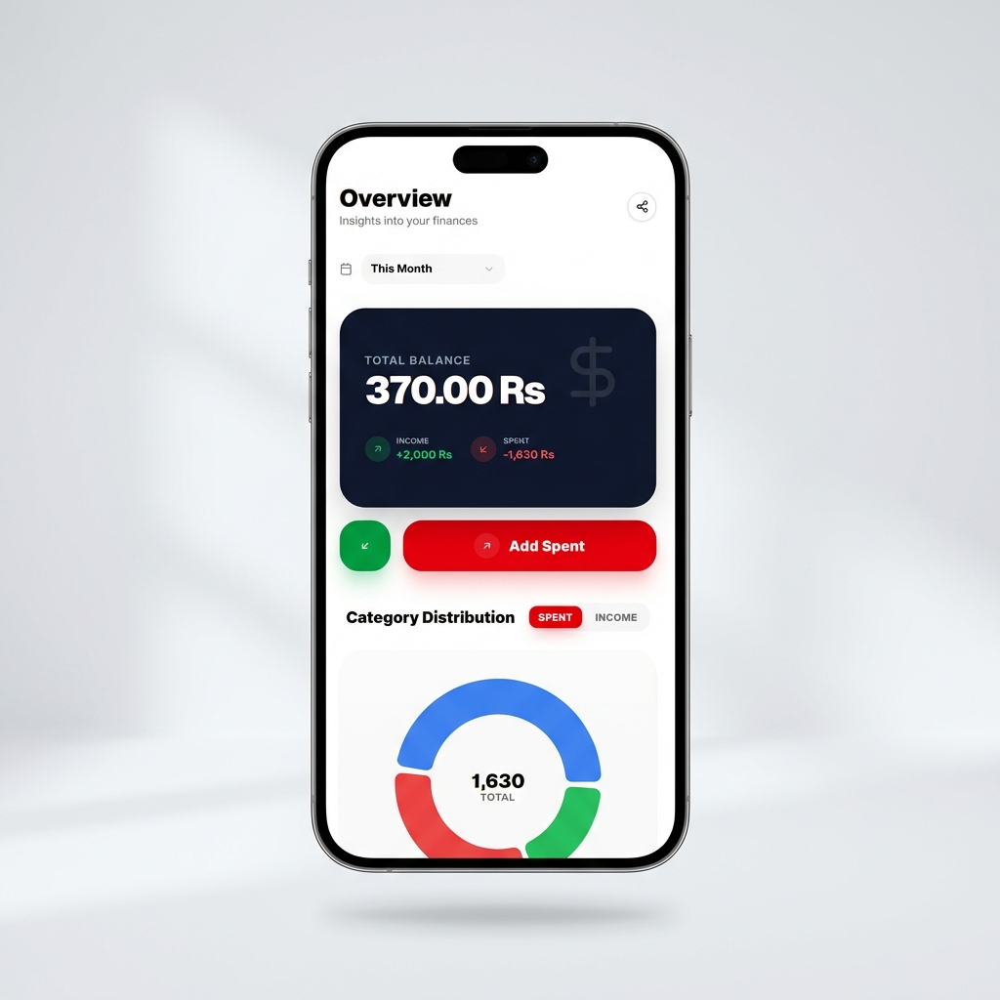

# DevinBook

**Next-Generation Financial Management App**

DevinBook is a premium, mobile-first expense tracking application designed to help you master your finances with style. Built with modern web technologies, it offers a seamless, app-like experience on any device.

## Features

### Premium UI/UX
*   **Glassmorphism Design:** A modern, sleek aesthetic with dark and light mode support.
*   **Mobile-First:** Fully responsive layout optimized for mobile devices.
*   **PWA Ready:** Installable on iOS and Android with shortcut support for quick actions.

### Secure Authentication
*   **Secure Login/Register:** Robust authentication system with password encryption.
*   **Toggle Interface:** Smooth transition between login and registration forms.
*   **Visibility Control:** show/hide password toggle for better user experience.

### Powerful Dashboard
*   **Interactive Charts:** Visualize your spending with dynamic donut charts.
*   **Real-time Tracking:** Instant updates to your balance and transaction history.
*   **PDF Reports:** Generate professional financial reports with a single click.

## Tech Stack

*   **Frontend:** [Next.js 15](https://nextjs.org/), [React 19](https://react.dev/), [Tailwind CSS](https://tailwindcss.com/)
*   **Backend:** Node.js, Express.js
*   **Database:** MongoDB
*   **UI Components:** [shadcn/ui](https://ui.shadcn.com/), Lucide Icons
*   **Visualization:** Recharts
*   **PWA:** Next-PWA

## PWA Features

DevinBook is designed to be installed on your home screen.
*   **Shortcuts:** Long-press the app icon to quick-add transactions or view categories.
*   **Standalone Mode:** Runs without browser UI for a native feel.

## License
This project is proprietary software designed by [Devinsol](https://devinsol.com).